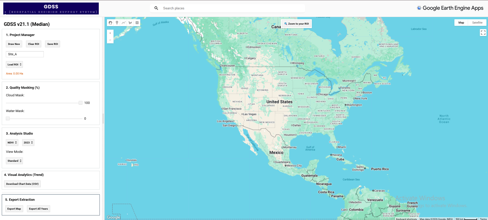
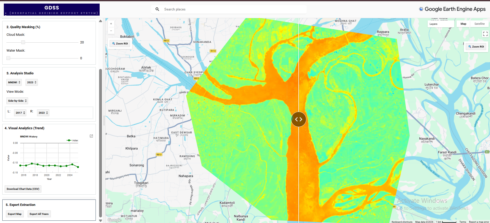
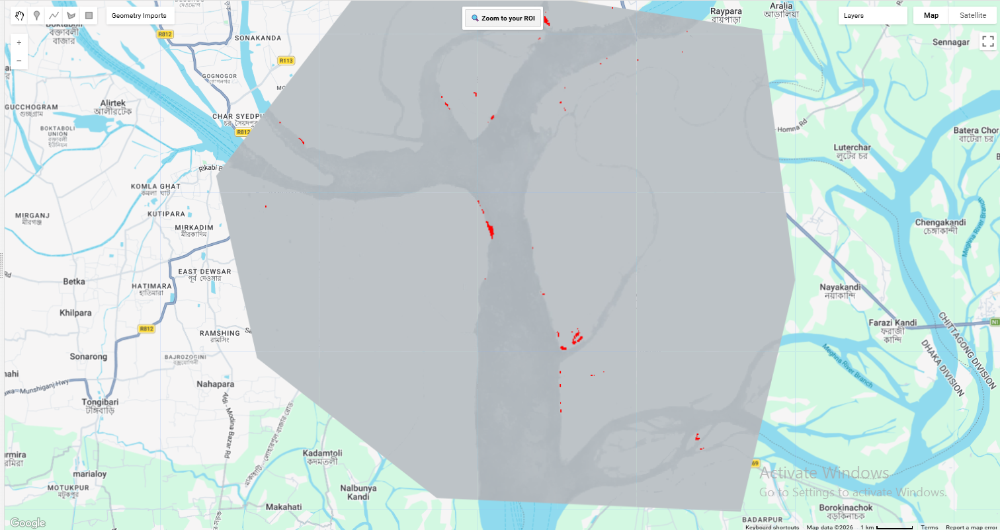

# Geospatial Decision Support System (GEE)

### About App
Based on our iterative development process, here is a comprehensive overview of the **Advanced Spectral Dashboard** we have conceptualized, its technical functionality, and its real-world impact across different sectors.

This is a custom-built **Web-based Geospatial Decision Support Tool** hosted on the Google Earth Engine (GEE) platform. Unlike static GIS software, this app connects directly to Google's massive cloud satellite archive to generate spectral indices and visualize data in an interactive interface.

---

## Core Functionality

The application is designed around a modular workflow: **Input $\to$ Process $\to$ Visualize $\to$ Analyze $\to$ Export.**

### 1. Advanced Spectral Engine (6 Indices)
The app dynamically calculates indices from raw satellite bands:
*   **Vegetation:** NDVI (Standard Greenness), EVI (Dense Forests).
*   **Water:** NDWI (General Water), MNDWI (Open Water/Suppresses Urban Noise).
*   **Urban:** NDBI (Built-up Areas).
*   **Thermal:** LST (Land Surface Temperature).

### 2. Intelligent ROI Management
Users are not limited to a single view.
*   **Dynamic Drawing:** Polygon-based selection of any size (from a single field to a whole country).
*   **Coordinate Import:** Allows integration with GPS data (KML/GeoJSON) or Lat/Lon bounding boxes.
*   **Save/Load System:** Users can name and store ROIs (e.g., "North Field," "Site A") for quick re-analysis, enabling longitudinal monitoring.

### 3. Dynamic Visualization & Storytelling
The app goes beyond standard maps to provide visual proof of change:
*   **Standard View:** High-quality single-year visualization.
*   **Side-by-Side View:** Splits map into two synchronized panels for direct visual comparison.

*   **Anomaly Detection:** Uses a slider threshold to isolate and highlight **only** significant changes (e.g., highlighting only pixels that lost >20% greenness in bright red).

### 4. Analytics
*   **Zonal Statistics:** Automatically calculates Min, Max, Median, and Standard Deviation for the selected area.
*   **Time-Series:** Generates detailed trend charts showing seasonal and decadal shifts.

### 5. Professional Workflow
*   **Batch Export:** Can queue up download tasks for 10+ years of data simultaneously.
*   **Data Export:** Exports data in universal formats (GeoTIFF for maps, CSV for charts) for integration into reports.

---

## Impact & Use Cases

This application bridges the gap between raw satellite data and practical decision-making.

### 1. For Farmers & Agronomists
*   **App Impact:**
    *   **Moisture Analysis:** Users toggle to **NDWI** to pinpoint fields drying out.
    *   **Harvest Planning:** Users use **EVI** to check crop density.
    *   **Result:** Reduced water usage and optimized fertilizer application.

### 2. For Environmentalists & NGOs
*   **App Impact:**
    *   **Visual Proof:** The **Side-by-Side View** provides undeniable before-and-after evidence of forest loss.
    *   **Anomaly:** Highlights sudden drops in **NDVI** which may indicate illegal clearing.
    *   **Result:** Faster intervention and stronger evidence for conservation advocacy.

### 3. For Urban Planners
*   **App Impact:**
    *   **Heat Monitoring:** **LST** layer identifies heat islands.
    *   **Urban Mapping:** **NDBI** layer clearly separates concrete from vegetation.
    *   **Water Quality:** **MNDWI** helps track shrinking water bodies.
    *   **Result:** Better urban planning and reservoir monitoring.

### 4. For Researchers & Consultants
*   **App Impact:**
    *   **Instant Processing:** GEE processes billions of pixels in seconds.
    *   **Zonal Stats:** Provides standard deviation instantly—critical for statistical validity.
    *   **Batch Export:** Allows consultants to download historical data instantly.
    *   **Result:** Increased billing capacity and ability to handle complex projects.

---

## Instructions

1. Copy the `index.js` file content from this repository.
2. Open the [Google Earth Engine Code Editor](https://code.earthengine.google.com/).
3. Paste the code into the editor and run.

---

## 📝 License

This project is licensed under the MIT License - see LICENSE file for details.

---

## 👨‍💻 Author

### Md. Mahmudul Hasan Novo

Built for Marketing Agency Analytics.
LinkedIn: https://www.linkedin.com/in/novo-mahmud
GitHub: https://github.com/novo-mahmud
Email: novomahmud@gmail,com

---
